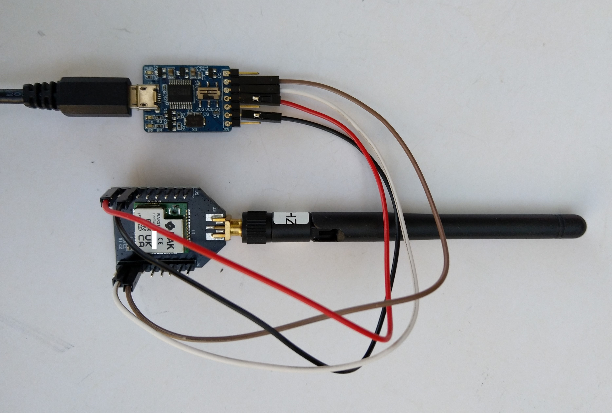
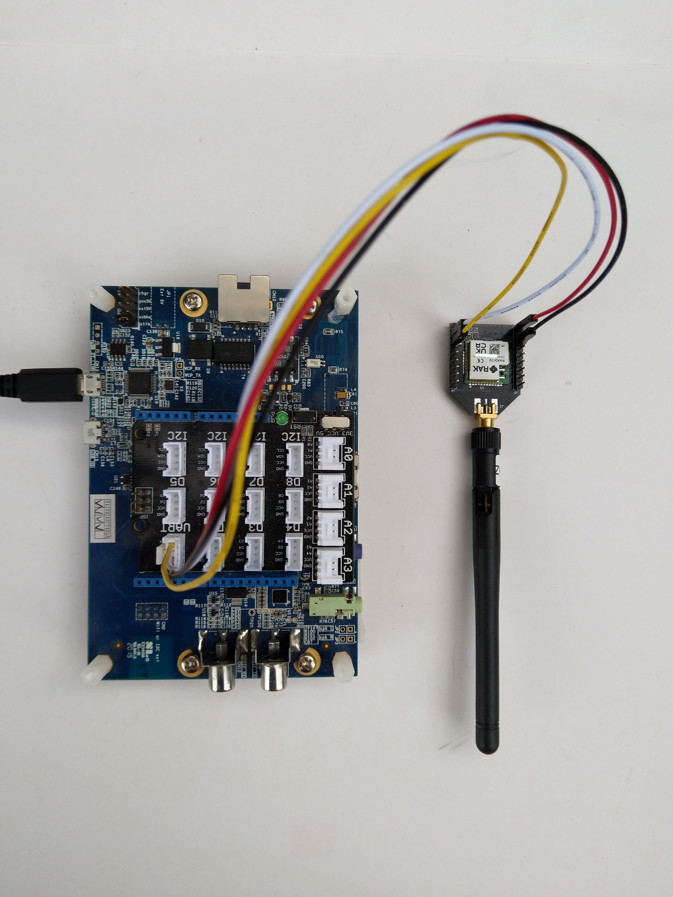
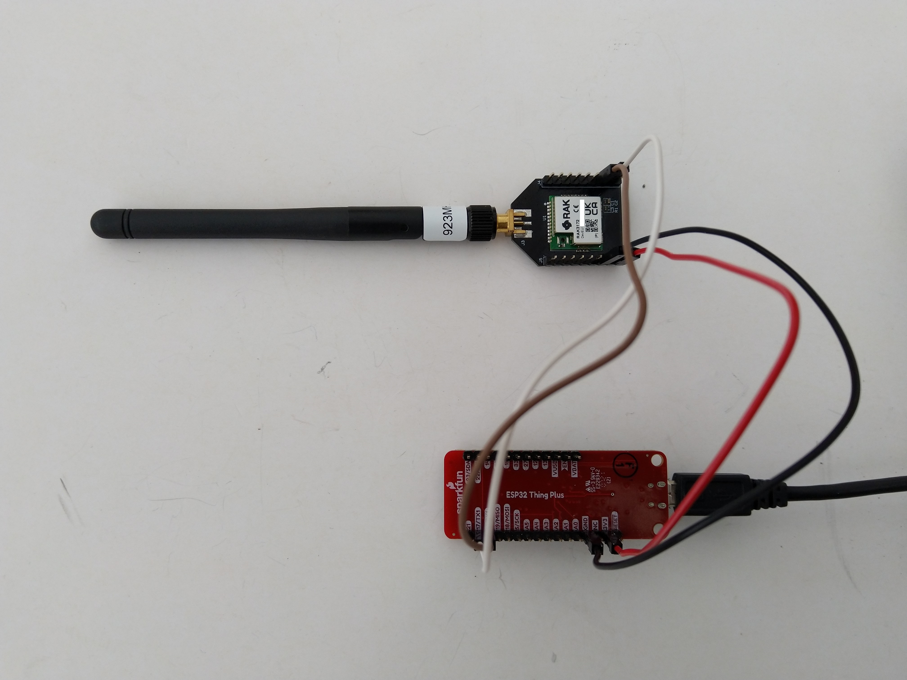

# RAK3172LoRaWAN.NetNF

A C# library for [LoRaWAN](https://lora-alliance.org/about-lorawan) connectivity for [RAKwireless](https://www.rakwireless.com/en-us) [RAK3172 Module](https://store.rakwireless.com/products/wisduo-lpwan-module-rak3172) equipped [.NET nanoFramework](https://www.nanoframework.net/) powered devices.

This repository has the source code for the series of blog posts written as I work on the library

01. [Basic connectivity](http://blog.devmobile.co.nz/2022/06/11/net-nanoframework-rak3172-lorawan-library-basic-connectivity/)
02. [Nasty OTAA Connect](http://blog.devmobile.co.nz/2022/07/04/net-nanoframework-rak3172-lorawan-library-otaa-join/)

I used a local [RAK7258 WisGate Edge Lite](https://store.rakwireless.com/collections/wisgate-edge/products/rak7258-micro-gateway) connected to [The Things Network](https://www.thethingsnetwork.org/) to test my implementation.
